# Module 5 - Java Profiling #

**After the profiling and performance optimization process is completed, perform a performance test again using JMeter, see the results, and compare with the first measurement. Is there an improvement from JMeter measurements?**
Jawaban: Ya, terdapat peningkatan performa pada setiap request yang dapat dilihat dari penurunan waktu yang signifikan pada sample time sehingga dapat disimpulkan bahwa proses performance optimization berhasil memperbaiki performa aplikasi yang belum optimal.

1.	**What is the difference between the approach of performance testing with JMeter and profiling with IntelliJ Profiler in the context of optimizing application performance?**
      Performance testing menggunakan JMeter bertujuan untuk mengukur throughput, response time, dan penggunaan resource ketika diberikan beban kerja dalam tertentu. Testing dengan JMeter berguna untuk memahami kapasitas aplikasi dalam simulasi penggunaannya di dunia nyata.
      Performance testing menggunakan IntelliJ Profiler digunakan untuk menganalisis perilaku runtime aplikasi dengan melihat penggunaan CPU, alokasi memori, dan lain-lain. Tujuan melakukan profiling adalah untuk melihat bagian kode yang menyebabkan masalah performa pada aplikasi.

2.	**How does the profiling process help you in identifying and understanding the weak points in your application?**
      IntelliJ Profiler menampilkan method yang paling banyak memakan resource sistem ketika dijalankan sehingga saya dapat langsung fokus ke method yang perlu diprioritaskan untuk ditingkatkan performanya.

3.	**Do you think IntelliJ Profiler is effective in assisting you to analyze and identify bottlenecks in your application code?**
      Ya, grafik yang ditampilkan IntelliJ Profiler efektif untuk saya menganalisis permasalahan performa pada aplikasi dengan melihat resouce yang digunakan ketika menjalankan aplikasi.

4.	**What are the main challenges you face when conducting performance testing and profiling, and how do you overcome these challenges?**
      Saya belum pernah melakukan performance testing dan profiling sebelumnya, jadi saya awalnya belum mengerti cara membaca dan menganalisis hasil yang muncul setelah melakukan keduanya. Tutorial yang diberikan membantu saya untuk memahami hasilnya dan mengidentifikasi masalah yang terdapat di aplikasi.

5.	**What are the main benefits you gain from using IntelliJ Profiler for profiling your application code?**
      Saya bisa langsung fokus ke akar masalah performa aplikasi karena Intellij Profiler menunjukkan bagian dari aplikasi yang memakan resource paling banyak.

6.	**How do you handle situations where the results from profiling with IntelliJ Profiler are not entirely consistent with findings from performance testing using JMeter?**
      Dalam profiling, saya melakukan siklus profiling, hit endpoint, dan lihat hasilnya minimal 3 kali untuk melihat rata-rata performa aplikasi. Hal yang serupa juga saya lakukan ketika melakukan performance testing dengan JMeter. Setelah melakukan perbaikan performa dan profiling dan performance testing lagi, saya melihat hasil pada Intellij Profiler dengan JMeter cukup konsisten dengan peningkatan performa yang terjadi pada aplikasi.

7.	**What strategies do you implement in optimizing application code after analyzing results from performance testing and profiling? How do you ensure the changes you make do not affect the application's functionality?**
      Saya menerapkan teknik yang lebih efisien pada suatu method, contohnya pada method joinStudentNames, saya menggunakan StringBuilder daripada melakukan konkatenasi string secara terus menerus yang boros memori. Selain itu, saya juga mempelajari penggunaan annotation @Query untuk melakukan query mahasiswa dengan GPA paling tinggi dan semua mahasiswa yang memiliki courses. Setelah melakukan perubahan, saya melakukan tes kembali untuk memastikan fungsionalitas serta output yang diberikan tetap sama seperti sebelumnya.

* JMeter Tests
  * all-student Request (Before)
    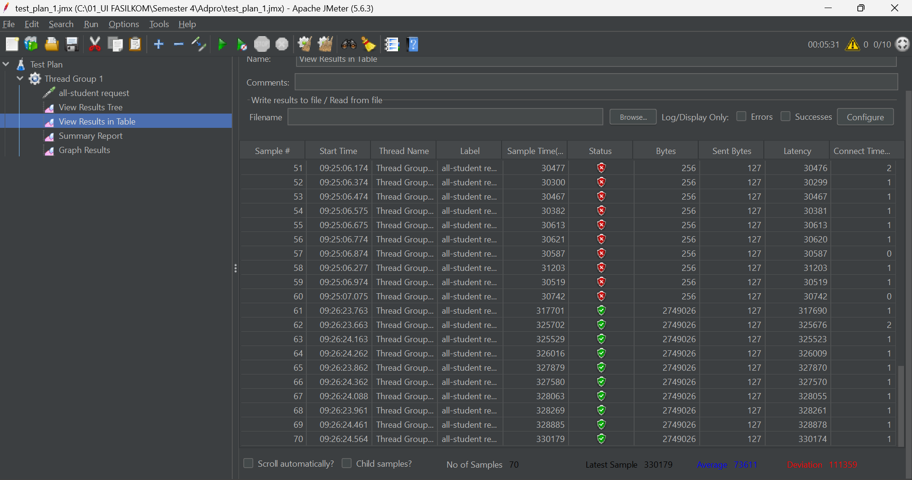
  * all-student Request (After)
    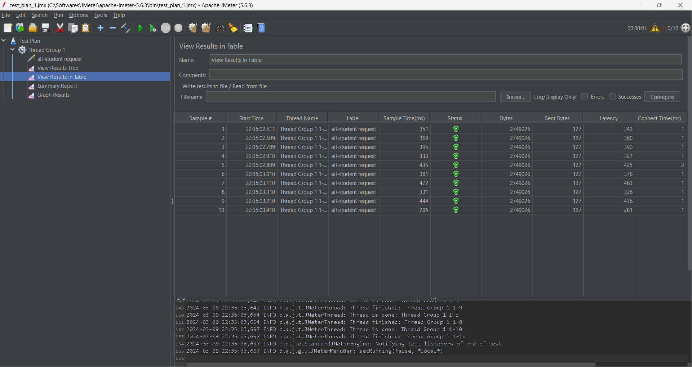
  * all-student-name Request (Before)
    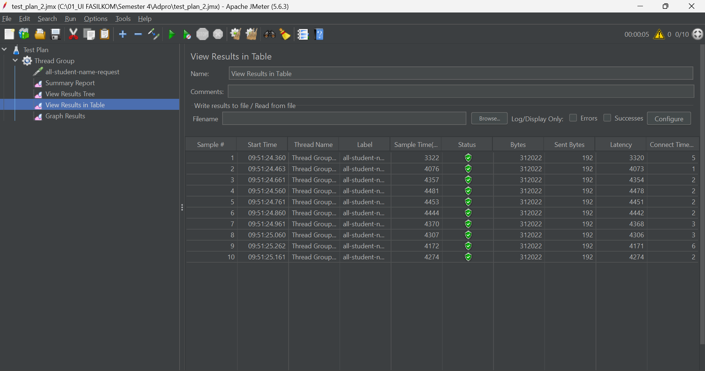
  * all-student-name Request (After)
    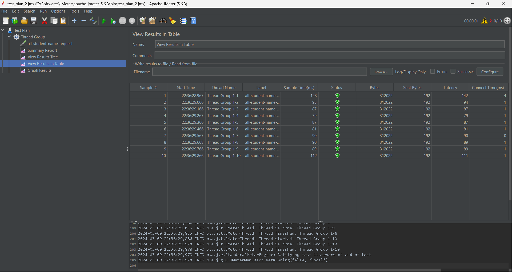
  * highest-gpa Request (Before)
    
  * highest-gpa Request (After)
    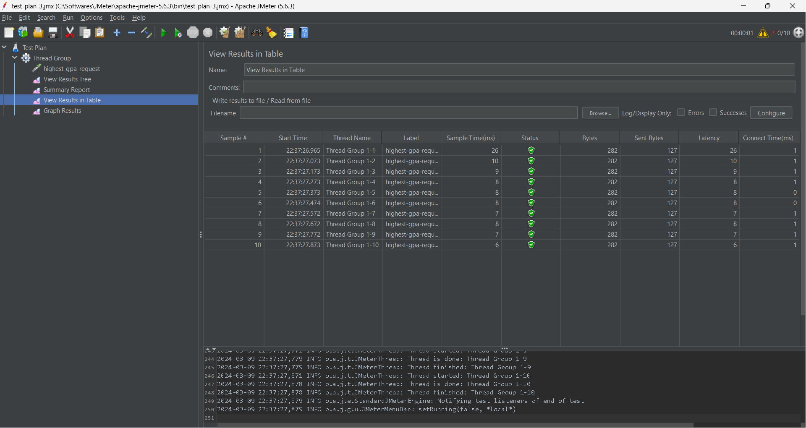

* JMeter Command Line Tests
    * all-student-name Request
      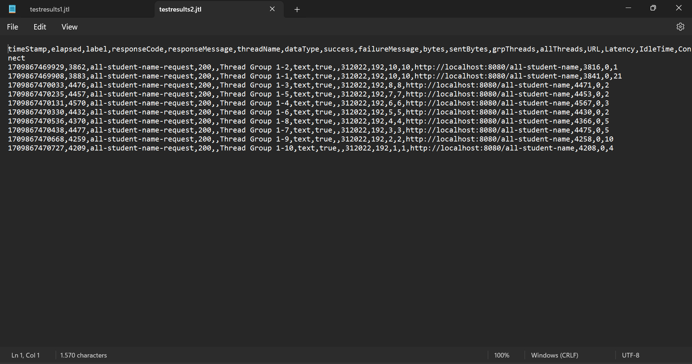
    * highest-gpa
      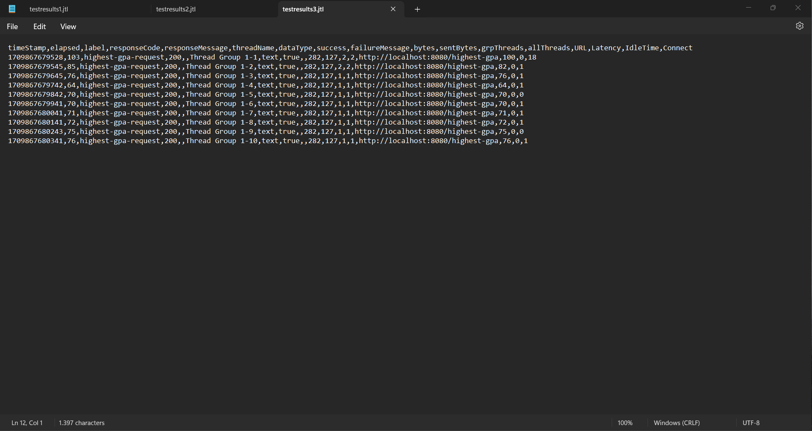

* Profiling with IntelliJ Profiler
    * allStudentName (Before)
      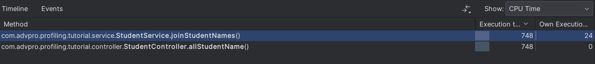
    * allStudentName (After)
      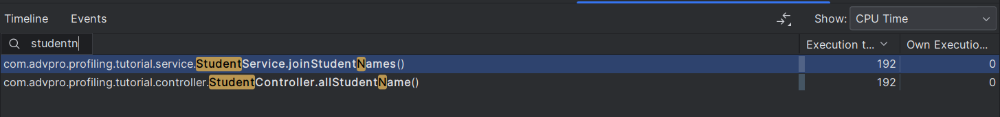
    * getAllStudentWithCourses (Before)
      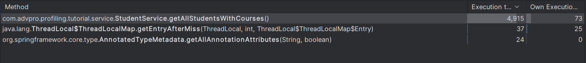
    * getAllStudentWithCourses (After)
      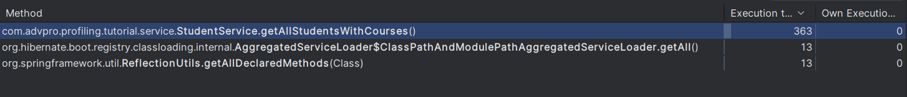
    * highestGpa (Before)
      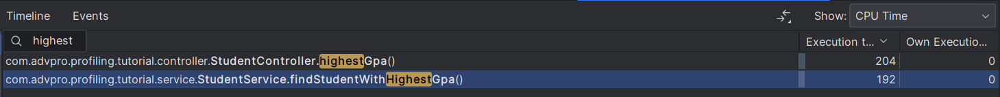
    * highestGpa (After)
      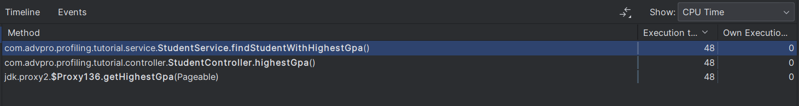